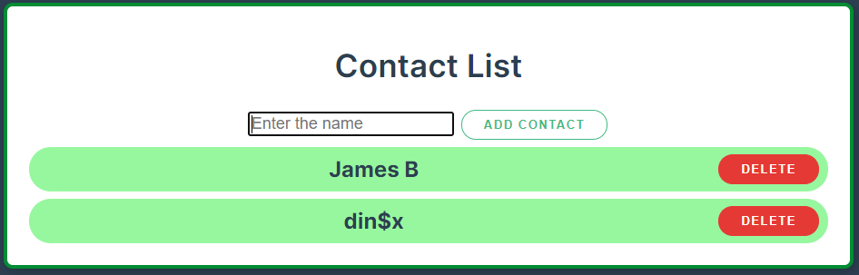
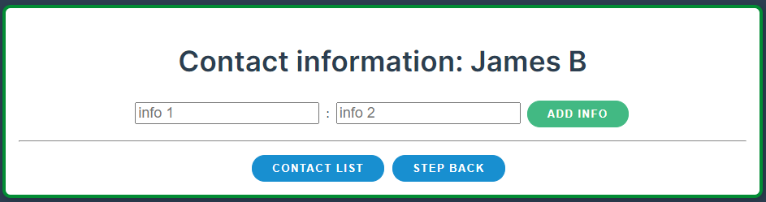
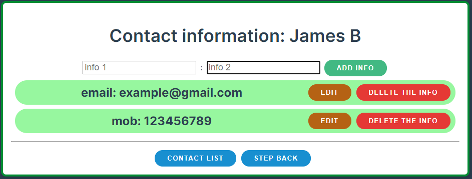
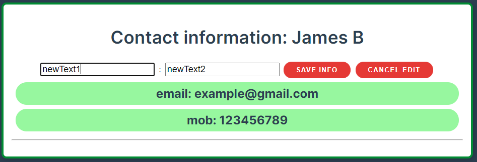
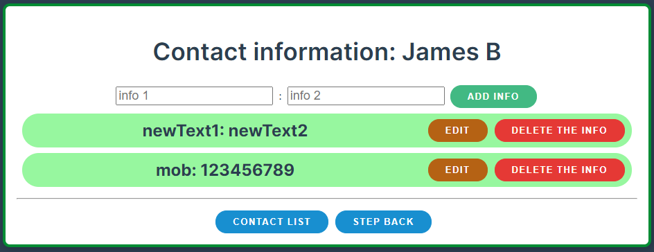

# “Contact List” App: Инструкция и функционал

## Главная страница:


```
• В поле ввода **(input)** следует ввести имя нового контакта (ограничений по количеству нет).
• Кнопка **«ADD CONTACT»** или клавиша **«Enter»** добавляет данные (новый контакт) в массив contacts и создает список по циклу.
```

## Добавление контактов:



```
• Кнопка **«DELETE»** вызывает окно с подтверждением удаления:
```

## Удаление контактов:


```
• Кнопка **«YES»** безвозвратно удаляет контакт. Кнопка **«NO»** возвращает к списку контактов.
• Для того, чтобы перейти в раздел информации по контакту, следует навести курсор в поле контакта и нажать на него.
```

## Переход к информации контакта:



```
• Поля **«info 1» и «info 2»** должны иметь данные, после чего добавляются кнопкой **«ADD INFO»** в список по типу **«info1: info2»** (ограничений по количеству нет).
```

## Добавление информации контакту:



```
• Кнопка **«DELETE THE INFO»** вызывает подтверждение перед удалением и (не) удаляет строчку информации из контактов.
• Кнопка **«EDIT»** позволяет отредактировать строку информации с последующим сохранением или отменой.
```

## Редактирование строки с информацией (c возможностью отмены):



## Сохранение внесенной информации «SAVE INFO»:



```
• Кнопка **«STEP BACK»** отменяет последнее изменение внутри строки после сохранения редактирования и/или отменяет последнее добавление новой строки.
• Кнопка **«CONTACT LIST»** возвращает к списку контактов.
```
